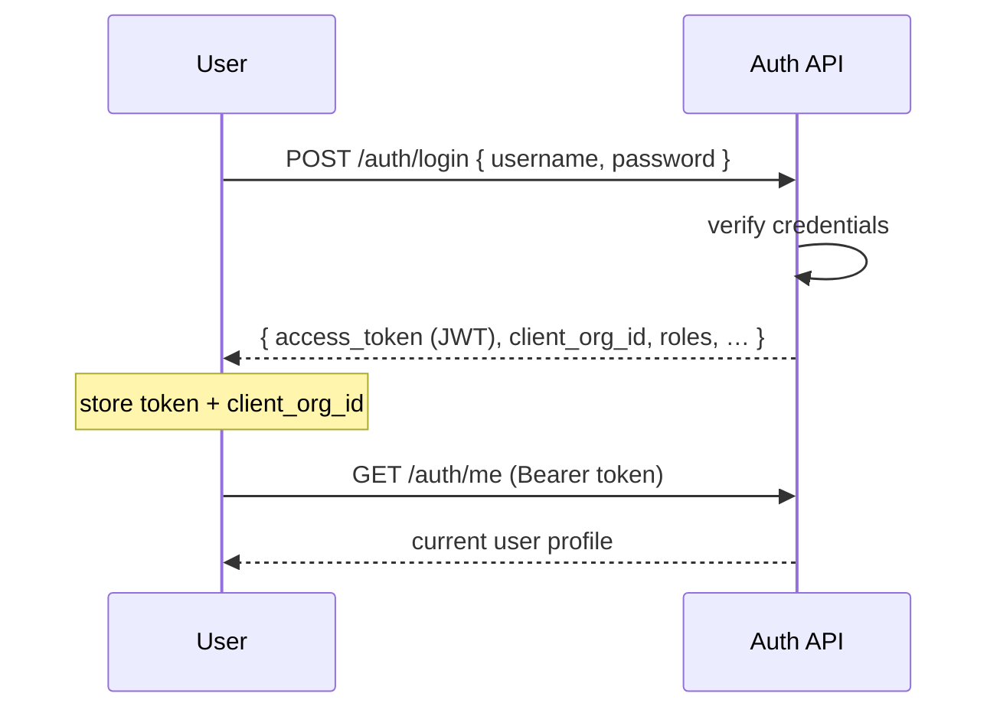

<Note>
**In plain English:** you sign in, and the system gives you a temporary pass (a
token) plus the name of the organisation you're working on. That pass unlocks every
later step and keeps each client's data separate.
</Note>

<CardGroup cols={2}>
  <Card title="Why this stage matters" icon="lock">
    It is the security gate. No token, no pipeline — and the token decides **which
    organisation's** data you can see.
  </Card>
  <Card title="What you walk away with" icon="ticket">
    A bearer token and the active `client_org_id` that scopes everything downstream.
  </Card>
</CardGroup>

Authentication is the gate. Every stage after this one requires a bearer token,
and almost every record is scoped to the organisation tied to that token.

## What happens

A user submits credentials. The service verifies them, issues a **signed JWT**
(the bearer token), and returns the user's profile and **active organisation**.
That `client_org_id` is the key that scopes documents, controls, issues, and
risks for the rest of the run.



## Inputs & outputs

<table>
  <thead><tr><th>In</th><th>Out</th></tr></thead>
  <tbody>
    <tr>
      <td>`username`, `password`</td>
      <td>`access_token`, `user_id`, `client_org_id`, `client_org_name`, `roles`</td>
    </tr>
  </tbody>
</table>

## Endpoints used

| Method | Path | Auth | Purpose |
| --- | --- | --- | --- |
| `POST` | `/auth/login` | **None** | Authenticate, return token + org |
| `POST` | `/auth/register` | **None** | Create a user (demo / admin) |
| `GET` | `/auth/me` | Bearer | Return the logged-in user's profile |

<Note>
`/auth/login`, `/auth/register`, and the health checks are the **only** public
routes. Everything else returns `401 UNAUTHORIZED` without a valid bearer token.
</Note>

### Login request

```json
{
  "username": "analyst@demo.local",
  "password": "Passw0rd!"
}
```

### Login response

```json
{
  "status": "success",
  "message": "Login successful",
  "data": {
    "access_token": "<JWT>",
    "user_id": "uuid",
    "client_org_id": "uuid",
    "client_org_name": "…",
    "tenant_id": "…",
    "folders": { "control_documents_folder": "…" },
    "roles": ["analyst"]
  }
}
```

### Failure modes

| HTTP | code | Meaning |
| --- | --- | --- |
| 401 | `AUTH_FAILED` | Wrong username/password |
| 403 | `UNAUTHORIZED` | Account disabled |
| 404 | `CLIENT_ORG_NOT_FOUND` | Org attached to user is missing |

## Roles

| Role | Can do |
| --- | --- |
| `analyst` | Run the full pipeline for their own organisation |
| `admin` | Create organisations and perform cross-org operations |

<Warning>
Treat the `access_token` as a secret. Send it only over the `Authorization`
header, never in a query string or log line.
</Warning>

## What feeds the next stage

The token authorises every later call, and `client_org_id` is the org you will
upload documents against in [Stage 02 · Organisation & Documents](/flow/02-org-documents).

Full request/response detail: [API Reference → Authentication](/api-reference/authentication).
