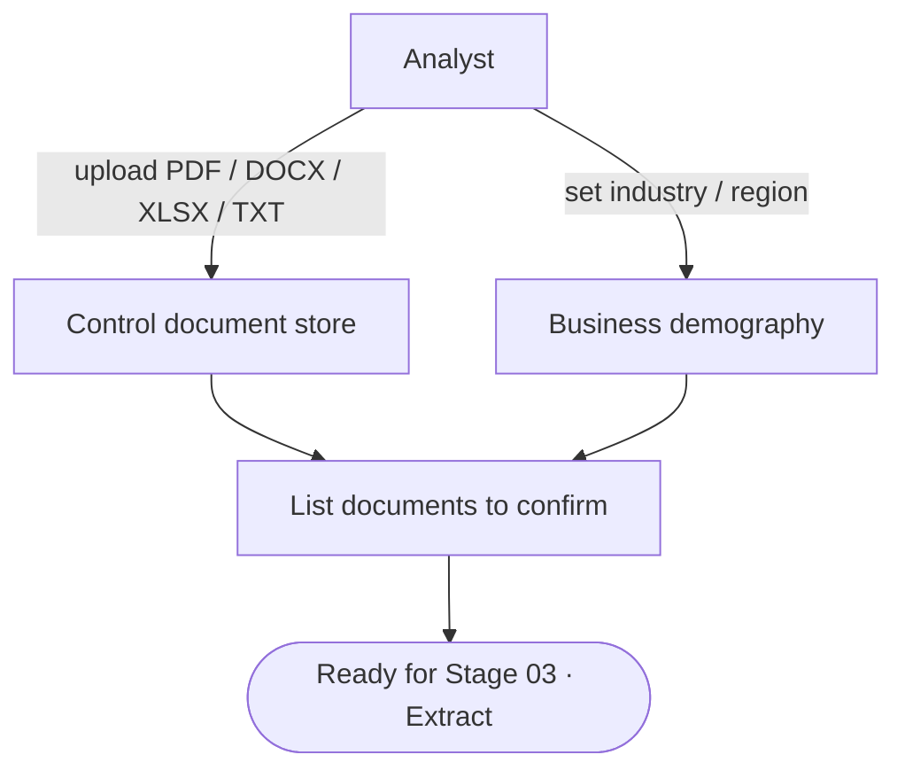

<Note>
**In plain English:** tell the system who the client is (industry, region) and give
it the documents to analyse — the policies, standards, and regulations they already
follow. This is the "feed it the source material" step.
</Note>

<CardGroup cols={2}>
  <Card title="Why this stage matters" icon="seedling">
    Everything downstream is only as good as the documents you supply. Garbage in,
    garbage out — quality source material means quality risks.
  </Card>
  <Card title="What you walk away with" icon="box-archive">
    Stored control documents and a business profile that contextualises later analysis.
  </Card>
</CardGroup>

Before anything can be extracted, the organisation needs (a) a business profile
that contextualises later analysis and (b) at least one **control document** to
mine. This stage handles both.

## What happens

The analyst uploads source files — policies, standards, regulations — into the
organisation's document folder, and optionally records the org's **business
demography** (industry, region). These documents become the raw material for
control extraction.



## Inputs & outputs

<table>
  <thead><tr><th>In</th><th>Out</th></tr></thead>
  <tbody>
    <tr>
      <td>`client_org_id`, `document_type`, `document_category`, file</td>
      <td>Stored `ControlDocument` records with `processing_status`</td>
    </tr>
    <tr>
      <td>`business_demography` (industry, region, …)</td>
      <td>A demography record id</td>
    </tr>
  </tbody>
</table>

## Endpoints used

| Method | Path | Auth | Purpose |
| --- | --- | --- | --- |
| `POST` | `/control-documents/upload` | Bearer | Upload a control document (multipart) |
| `GET` | `/control-documents/{orgId}` | Bearer | List uploaded documents for an org |
| `GET` | `/control-documents/stats/{orgId}` | Bearer | Quick counts (documents, controls) |
| `GET` | `/orgs` | Bearer | List organisations |
| `POST` | `/business-demography/update` | Bearer | Update the org business profile |
| `GET` | `/business-demography/{orgId}` | Bearer | Read the org business profile |

### Upload (multipart form fields)

| Field | Example | Notes |
| --- | --- | --- |
| `client_org_id` | `686f6c71-…` | Target organisation |
| `document_type` | `policy` | Free-text classifier |
| `document_category` | `ISO27001` | Optional framework tag |
| `file` | `policy.pdf` | The file itself |

<Info>
Only **PDF** files can be control-extracted in [Stage 03](/flow/03-extract-controls).
Other formats can be stored, but extraction targets PDFs.
</Info>

### List documents response

```json
{
  "status": "success",
  "data": {
    "documents": [
      {
        "id": "uuid",
        "client_org_id": "uuid",
        "filename": "policy.pdf",
        "document_path": "…",
        "document_type": "policy",
        "processing_status": "pending",
        "created_at": "…"
      }
    ]
  }
}
```

### Stats response

```json
{
  "status": "success",
  "data": { "client_org_id": "…", "documents": 3, "controls": 47 }
}
```

## Why demography matters

The `industry` and `region` you set here flow downstream as hints — they shape how
issues are sectorised and how classification charts are labelled (for example,
`industry=Logistics & Supply Chain`, `region=GCC`). Setting them early produces
more relevant analysis later.

## What feeds the next stage

Once the org has at least one PDF (confirm with the list/stats endpoints), it is
ready for [Stage 03 · Extract Controls](/flow/03-extract-controls), which reads
exactly these documents.

Full request/response detail: [API Reference → Organisation & Documents](/api-reference/org-documents).
