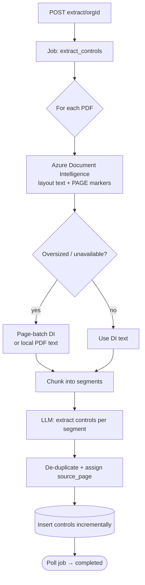

<Note>
**In plain English:** the system reads every uploaded PDF and pulls out each
individual rule or requirement — like a highlighter that finds every "must,"
"shall," and "is required to," and notes the page it found it on.
</Note>

<CardGroup cols={2}>
  <Card title="Why this stage matters" icon="magnifying-glass">
    It converts unstructured documents into structured, countable requirements —
    the foundation every later risk is built on.
  </Card>
  <Card title="What you walk away with" icon="list-ol">
    A list of **controls**, each with its text, framework reference, and source page.
  </Card>
</CardGroup>

This is the first heavy-lifting stage and the first **background job**. It reads
the org's PDFs and produces **controls** — one row per distinct auditable
requirement, each traceable back to a source page.

<Tooltip tip="A 'control' is one distinct, auditable requirement — a single obligation, mandatory procedure, or measurable rule.">What is a "control"?</Tooltip> See the [Glossary](/process/glossary) for every term used in this stage.

## What happens

For each PDF, the worker extracts layout-aware text (with `[PAGE N]` markers),
splits it into segments, and asks the LLM to emit **one control per clause /
bullet / distinct obligation**. Controls are de-duplicated and committed
incrementally, so they appear in the database while the job is still running.



## Inputs & outputs

<table>
  <thead><tr><th>In</th><th>Out</th></tr></thead>
  <tbody>
    <tr>
      <td>An org with uploaded PDFs</td>
      <td>`controls` rows: `control_text`, `section_ref`, `framework`, `source_page`</td>
    </tr>
  </tbody>
</table>

## The job, step by step

<Steps>
  <Step title="Start the job">
    `POST /control-documents/extract/{orgId}` with body `{}`. Returns a `job_id`
    and `documents_queued`, status `pending`.
  </Step>
  <Step title="Worker reads each PDF">
    Azure Document Intelligence converts the PDF to layout text with `[PAGE N]`
    markers. If DI rejects an oversized file, the worker falls back to **page-batch**
    DI or to **local** PDF text extraction so processing never simply stops.
  </Step>
  <Step title="LLM extracts controls">
    Each text segment is sent to the LLM with a strict instruction: emit one
    control per numbered clause, bullet, or distinct obligation — not document
    titles or generic intros. The model returns a JSON `controls` array.
  </Step>
  <Step title="De-duplicate & page-stamp">
    Exact duplicates are merged; each control's `source_page` is set from the
    nearest preceding `[PAGE N]` marker.
  </Step>
  <Step title="Poll and read">
    Poll `GET /jobs/{jobId}` until `completed`. Read results with
    `GET /controls?client_org_id=…` — the list grows during the run.
  </Step>
</Steps>

## Endpoints used

| Method | Path | Auth | Purpose |
| --- | --- | --- | --- |
| `POST` | `/control-documents/extract/{orgId}` | Bearer | Start the `extract_controls` job |
| `GET` | `/jobs/{jobId}` | Bearer | Poll job status / progress |
| `GET` | `/controls?client_org_id=…` | Bearer | List extracted controls |

### Start response

```json
{
  "status": "accepted",
  "data": {
    "job_id": "uuid",
    "documents_queued": 2,
    "folder": "…",
    "processing_status": "in_progress"
  }
}
```

### A control row

```json
{
  "id": "uuid",
  "document_id": "uuid",
  "client_org_id": "uuid",
  "control_text": "Access to production systems must be reviewed quarterly.",
  "section_ref": "A.9.2.5",
  "framework": "ISO 27001",
  "source_page": 14,
  "created_at": "…"
}
```

<Tip>
Extraction is intentionally **high-recall** — a page with twelve bullets should
yield about twelve controls. It is better to capture every requirement and let
later stages cluster them than to merge and lose detail.
</Tip>

## Resilience

- **Oversized PDFs** are processed in page batches rather than failing outright.
- **DI unavailable** → the worker uses local PDF text.
- **LLM returns nothing** for a segment → a retry, then optionally a heuristic
  salvage pass, so usable controls still emerge.

## What feeds the next stage

Controls are the raw input to [Stage 04 · Issues](/flow/04-issues), where related
controls are clustered into risk issues.

Full request/response detail: [API Reference → Controls](/api-reference/controls).
