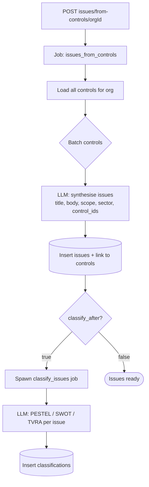

<Note>
**In plain English:** a single rule rarely is a risk on its own. This step groups
related rules together and asks "what could go wrong here?" — turning dozens of
requirements into a handful of clear risk themes.
</Note>

<CardGroup cols={2}>
  <Card title="Why this stage matters" icon="brain">
    This is where raw requirements become **risk thinking** — the themes that the
    board actually cares about.
  </Card>
  <Card title="What you walk away with" icon="layer-group">
    A set of **issues** (risk themes), each linked to the controls it came from, and
    optionally classified across PESTEL / SWOT / TVRA.
  </Card>
</CardGroup>

Controls describe *what an organisation is required to do*. **Issues** describe
*the risk themes those controls address or expose*. This stage turns a flat list
of controls into a structured set of issues, and optionally classifies them in the
same run.

## What happens

The worker loads all of the org's controls, processes them in batches, and asks
the LLM to synthesise **3–8 issues per batch**, each citing the `control_ids` it
was derived from. If `classify_after` is set, a **chained** classification job is
spawned automatically once the issues exist.



## Inputs & outputs

<table>
  <thead><tr><th>In</th><th>Out</th></tr></thead>
  <tbody>
    <tr>
      <td>An org's controls; flags `replace_existing`, `classify_after`</td>
      <td>`issues` (title, body, scope, sector, control_ids) + optional classifications</td>
    </tr>
  </tbody>
</table>

## Two jobs, one trigger

<Steps>
  <Step title="Generate issues">
    `POST /issues/from-controls/{orgId}` with `{ "replace_existing": true, "classify_after": true }`.
    The `issues_from_controls` job clusters controls into issues.
  </Step>
  <Step title="Classification spawns automatically">
    Because `classify_after` is `true`, the issues job completes the moment issues
    exist and **spawns a separate `classify_issues` job**. Track it with its own
    `job_id`.
  </Step>
  <Step title="Read issues">
    `GET /issues?client_org_id=…&include_classification=true`. Re-run while the
    classify job runs to see classifications fill in.
  </Step>
</Steps>

<Note>
Splitting the jobs means issue creation is never blocked by the slower
classification work — and the UI can show each job's progress independently. See
[Background Jobs → Chained jobs](/process/background-jobs).
</Note>

## Endpoints used

| Method | Path | Auth | Purpose |
| --- | --- | --- | --- |
| `POST` | `/issues/from-controls/{orgId}` | Bearer | Start `issues_from_controls` (+ optional classify) |
| `POST` | `/issues/classify` | Bearer | Start `classify_issues` for specific/all issues |
| `GET` | `/jobs/{jobId}` | Bearer | Poll either job |
| `GET` | `/issues?client_org_id=…` | Bearer | List issues (optionally with classification) |
| `GET` | `/issues/{issueId}` | Bearer | Get a single issue |
| `GET` | `/issues/{issueId}/classification` | Bearer | Get an issue's classification |
| `GET` | `/issues/stats/{orgId}` | Bearer | Issue counts for the org |

### Generate issues request

```json
{
  "replace_existing": true,
  "classify_after": true,
  "sector_hint": null,
  "region_hint": null
}
```

### An issue row

```json
{
  "id": "uuid",
  "title": "Quarterly access review gaps",
  "body": "Controls require periodic access reviews but lack…",
  "client_org_id": "uuid",
  "issue_scope": "internal",
  "origin": "from_controls",
  "control_ids": ["uuid", "uuid"]
}
```

## What classification adds

The `classify_issues` job tags each issue across four lenses:

<CardGroup cols={2}>
  <Card title="PESTEL" icon="layer-group">
    Political, Economic, Social, Technological, Environmental, Legal — 12–18 items.
  </Card>
  <Card title="SWOT" icon="table-cells">
    Strengths, weaknesses, opportunities, threats.
  </Card>
  <Card title="TVRA" icon="shield-halved">
    Threats, vulnerabilities, and threat actors with likelihood / impact.
  </Card>
  <Card title="Geo / Global" icon="globe">
    Geopolitical tags and cross-cutting global labels.
  </Card>
</CardGroup>

## What feeds the next stages

- The classifications are consumed by [Stage 05 · Classifications](/flow/05-classifications)
  to build chart data.
- The issues themselves feed [Stage 06 · Risk Discovery](/flow/06-risk-discovery)
  and [Stage 07 · Risk Scoring](/flow/07-risk-scoring).

Full request/response detail: [API Reference → Issues](/api-reference/issues).
