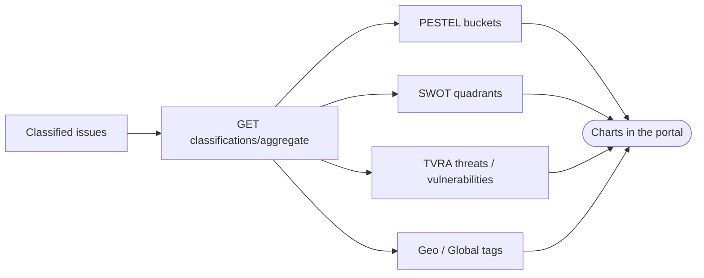

<Note>
**In plain English:** this step organises the analysis into the familiar business
frameworks — PESTEL, SWOT, and a threat assessment — so leadership can see the risk
landscape in pictures they already understand.
</Note>

<CardGroup cols={2}>
  <Card title="Why this stage matters" icon="presentation-screen">
    It translates raw analysis into **board-room frameworks** and chart data —
    making risk legible to non-specialists.
  </Card>
  <Card title="What you walk away with" icon="chart-column">
    Aggregated PESTEL / SWOT / TVRA / geo data ready to chart, for one issue or the
    whole organisation.
  </Card>
</CardGroup>

Stage 04 produced per-issue classifications. This stage **aggregates** them into
the structured chart data the portal renders — PESTEL, SWOT, TVRA, and geo/global
views — for a single focused issue or across the organisation.

<Expandable title="What do PESTEL, SWOT, and TVRA mean?">
  - **PESTEL** — Political, Economic, Social, Technological, Environmental, Legal.
    A scan of the external forces acting on the organisation.
  - **SWOT** — Strengths, Weaknesses, Opportunities, Threats. The classic internal
    vs. external posture grid.
  - **TVRA** — Threat, Vulnerability & Risk Assessment. Who might attack, the weak
    points they'd exploit, and how likely/severe it would be.
</Expandable>

## What happens

This is a **synchronous read** (no job). The API gathers the classifications,
counts and groups them by lens, and returns a single payload ready for charting,
optionally focused on one issue and labelled with an industry and region.



## Inputs & outputs

<table>
  <thead><tr><th>In</th><th>Out</th></tr></thead>
  <tbody>
    <tr>
      <td>`issue_id` (optional focus), `industry`, `region` labels</td>
      <td>Counts + grouped PESTEL / SWOT / TVRA / geo data</td>
    </tr>
  </tbody>
</table>

<Warning>
Run this **after** the `classify_issues` job from Stage 04 has completed. With no
classified issues there is nothing to aggregate.
</Warning>

## Endpoints used

| Method | Path | Auth | Purpose |
| --- | --- | --- | --- |
| `GET` | `/classifications/aggregate` | Bearer | Chart data (PESTEL / SWOT / TVRA / geo) |
| `GET` | `/summary` | Bearer | Global DB counts (documents, controls, issues, …) |

### Query parameters

| Param | Example | Notes |
| --- | --- | --- |
| `issue_id` | `uuid` | Optional — focus a single issue |
| `industry` | `Logistics & Supply Chain` | Display label |
| `region` | `GCC` | Display label |

### Response shape

```json
{
  "focused_issue": { "id": "…", "title": "…", "has_classification": true },
  "counts": { "pestel": 14, "swot": 20, "tvra": 8, "geo_global": 6 },
  "summary": {
    "sources": 12, "classified": 12, "signals": 40,
    "llm": 10, "heuristic": 2, "industry": "…", "region": "…"
  },
  "agents": [],
  "pestel": { "Political": [], "Economic": [], "Social": [], "Technological": [], "Environmental": [], "Legal": [] },
  "swot": { "strengths": [], "weaknesses": [], "opportunities": [], "threats": [] },
  "tvra": [ { "type": "threat", "likelihood": "high", "impact": "extreme" } ],
  "geo_global": { "geopolitical": [], "enforcement": [], "best_practice": [], "global_risk": [] }
}
```

<Info>
The `summary` block reports how many issues were classified by the **LLM** versus
the **heuristic** fallback — a quick confidence signal for the analysis.
</Info>

## What feeds the next stage

Classifications are an analytical view for human review; they do not block
[Stage 06 · Risk Discovery](/flow/06-risk-discovery), which works from the issues
directly. In practice, analysts use these charts to understand the risk landscape
before reviewing discovered and scored risks.

Full request/response detail: [API Reference → Classifications](/api-reference/classifications).
