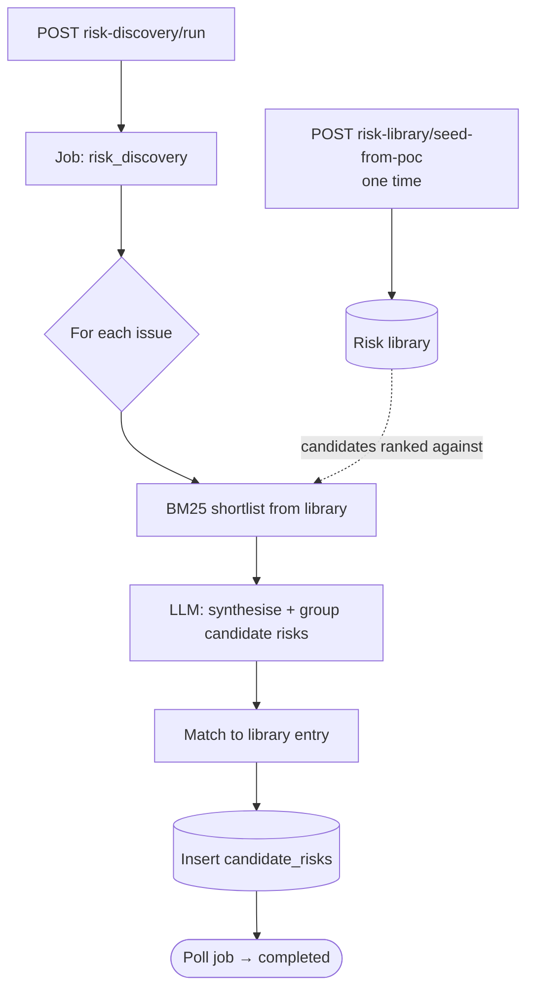

<Note>
**In plain English:** the system compares the organisation's risk themes against a
library of risks seen across the industry, and suggests which known risks apply —
so nothing obvious gets missed and each suggestion is backed by a match.
</Note>

<CardGroup cols={2}>
  <Card title="Why this stage matters" icon="book-open-reader">
    It cross-checks your specific situation against **industry-wide knowledge**,
    surfacing risks an analyst might overlook.
  </Card>
  <Card title="What you walk away with" icon="clipboard-list">
    A list of **candidate risks**, each showing whether it matched a known library
    risk and how strong that match was.
  </Card>
</CardGroup>

Discovery connects the org's **issues** to a curated catalogue of known enterprise
risks — the **risk library** — and proposes **candidate risks**. It combines
keyword ranking (<Tooltip tip="BM25 is a well-established keyword-ranking algorithm — it scores how well a library entry matches the issue text. The score is shown as bm25_score, so matches are explainable.">BM25</Tooltip>)
with an LLM pass so the matches are both fast and context-aware.

## What happens

First the library is **seeded once** from the POC catalogue. Then the
`risk_discovery` job, for each issue, shortlists the most relevant library entries
via BM25, asks the LLM to synthesise and group candidate risks, and records each
candidate with its match status, library link, BM25 score, and source issue ids.



## Inputs & outputs

<table>
  <thead><tr><th>In</th><th>Out</th></tr></thead>
  <tbody>
    <tr>
      <td>Seeded risk library + the org's issues</td>
      <td>`candidate_risks`: title, match_status, library_risk_id, bm25_score, issue_ids</td>
    </tr>
  </tbody>
</table>

## The job, step by step

<Steps>
  <Step title="Seed the library (once)">
    `POST /risk-library/seed-from-poc` loads the catalogue into the
    `risk_library` table. This is **synchronous**, not a job. Confirm with
    `GET /risk-library`.
  </Step>
  <Step title="Run discovery">
    `POST /risk-discovery/run` starts the `risk_discovery` job. BM25 shortlists
    library entries per issue; the LLM then proposes and groups candidate risks.
  </Step>
  <Step title="Poll and read">
    Poll `GET /jobs/{jobId}` until `completed`, then read
    `GET /candidate-risks`. Use `GET /discovery-export` for the full JSON bundle.
  </Step>
</Steps>

## Endpoints used

| Method | Path | Auth | Purpose |
| --- | --- | --- | --- |
| `POST` | `/risk-library/seed-from-poc` | Bearer | One-time library seed (sync) |
| `GET` | `/risk-library` | Bearer | List the risk catalogue |
| `POST` | `/risk-discovery/run` | Bearer | Start the `risk_discovery` job |
| `GET` | `/jobs/{jobId}` | Bearer | Poll job status |
| `GET` | `/candidate-risks` | Bearer | List discovered candidate risks |
| `GET` | `/discovery-export` | Bearer | Full discovery export bundle |

### Seed response

```json
{ "entries": 81, "csv_path": "data/curated/risk_library_seed.csv" }
```

### A candidate risk

```json
{
  "id": "uuid",
  "title": "Third-party data processor non-compliance",
  "match_status": "matched",
  "library_risk_id": "uuid",
  "bm25_score": 12.84,
  "issue_ids": ["uuid", "uuid"]
}
```

## How matching works

<CardGroup cols={2}>
  <Card title="BM25 shortlist" icon="magnifying-glass">
    A keyword-ranking algorithm scores every library entry against the issue text
    and keeps the top candidates — fast, deterministic, and explainable via the
    `bm25_score`.
  </Card>
  <Card title="LLM synthesis" icon="robot">
    The model groups related issues into coherent candidate risks and aligns them
    to the shortlisted library entries, adding context the keyword score cannot.
  </Card>
</CardGroup>

<Tip>
`match_status` tells you whether a candidate was aligned to an existing library
entry or is a newly synthesised risk — useful when curating which risks to carry
forward.
</Tip>

## What feeds the next stage

Candidate risks (and the issues behind them) are the input to
[Stage 07 · Risk Scoring](/flow/07-risk-scoring), which assigns inherent and
residual ratings.

Full request/response detail: [API Reference → Risk Discovery](/api-reference/risk-discovery).
