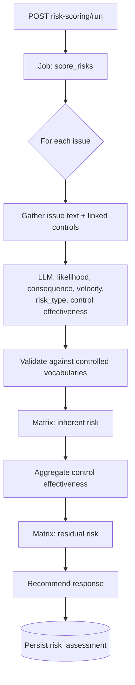

<Note>
**In plain English:** each risk gets a rating. The AI judges *how likely* and *how
bad* something is and *how well current controls cover it* — then a fixed scoring
chart (not the AI) turns those judgments into the actual High / Medium / Low rating.
That's what makes the score defensible.
</Note>

<CardGroup cols={2}>
  <Card title="Why this stage matters" icon="scale-balanced">
    This produces the **numbers the board sees** — and produces them by a transparent,
    repeatable method, not gut feel.
  </Card>
  <Card title="What you walk away with" icon="ranking-star">
    A risk assessment per issue: **inherent risk**, **residual risk**, and a
    recommended response (Accept / Mitigate / Transfer / Avoid).
  </Card>
</CardGroup>

Scoring is where issues become **rated risks**. The defining principle: the LLM
provides only *qualitative judgments*; every *number and rating* is computed by
fixed, published matrices. This makes scores **repeatable, tunable, and
defensible** — the same judgments always yield the same rating.

<Expandable title="Inherent vs. residual risk — what's the difference?">
  - **Inherent risk** — how bad the risk is *before* accounting for any controls.
    The raw exposure.
  - **Residual risk** — how bad it remains *after* the existing controls do their
    job. The exposure you actually live with.

  A big gap between the two means controls are doing heavy lifting; a small gap on a
  high inherent risk means you're exposed.
</Expandable>

## What happens

For each issue, the worker gathers the issue text and its linked controls, asks the
LLM (as a senior ISO 31000 / ISO 27001 assessor) to rate likelihood, consequence,
velocity, risk type, and each control's effectiveness, **validates** those against
controlled vocabularies, then derives inherent risk, residual risk, and the
recommended response from the matrices.



## Inputs & outputs

<table>
  <thead><tr><th>In</th><th>Out</th></tr></thead>
  <tbody>
    <tr>
      <td>`issue_ids` (and optional control texts)</td>
      <td>A `risk_assessment` per issue: inherent + residual + response</td>
    </tr>
  </tbody>
</table>

## What the LLM decides vs. what the matrix decides

<CardGroup cols={2}>
  <Card title="LLM — judgment only" icon="robot">
    `likelihood`, `consequence`, `velocity`, `risk_type`, and per-control
    `effectiveness` + explanation. It does **not** compute any rating.
  </Card>
  <Card title="Matrices — calculation" icon="calculator">
    `inherent_risk`, `overall_control_effectiveness`, `residual_risk`, and
    `risk_response` are all derived deterministically.
  </Card>
</CardGroup>

## The scoring matrices

### Inherent risk = consequence × likelihood

| Consequence \ Likelihood | Rare | Unlikely | Possible | Likely | Almost Certain |
| --- | --- | --- | --- | --- | --- |
| **Insignificant** | Low | Low | Low | Medium | Medium |
| **Minor** | Low | Low | Medium | Medium | High |
| **Moderate** | Low | Medium | Medium | High | High |
| **Major** | Medium | Medium | High | High | Extreme |
| **Severe** | Medium | High | High | Extreme | Extreme |

<Note>
**Velocity escalation:** an `Immediate` velocity bumps an already-`High` inherent
risk up one band (to `Extreme`).
</Note>

### Control effectiveness (aggregated)

Per-control ratings map to scores — `Effective`=3, `Partially Effective`=2,
`Ineffective`=1, `Uncontrolled`=0 — and the rounded mean yields the **overall
effectiveness**.

### Residual risk = inherent × overall effectiveness

| Inherent \ Effectiveness | Effective | Partially Effective | Ineffective | Uncontrolled |
| --- | --- | --- | --- | --- |
| **Low** | Low | Low | Low | Medium |
| **Medium** | Low | Medium | Medium | High |
| **High** | Medium | High | High | Extreme |
| **Extreme** | High | High | Extreme | Extreme |

### Recommended response

| Residual risk | Response |
| --- | --- |
| Low | Accept |
| Medium / High | Mitigate (or **Transfer** for insurable types: Financial, Third Party, Business Continuity) |
| Extreme | Mitigate / Avoid (owner decides) |

<Info>
The matrices are **policy, not code detail** — they are meant to be tuned to an
organisation's risk appetite without changing how the model is prompted.
</Info>

## The job, step by step

<Steps>
  <Step title="Run scoring">
    `POST /risk-scoring/run` with `{ "issue_ids": ["…"] }`. Omit `issue_ids` to
    score all of the org's issues.
  </Step>
  <Step title="Poll">
    `GET /jobs/{jobId}` until `completed`. A single bad issue is logged and skipped
    — it never kills the batch.
  </Step>
  <Step title="Read the assessment">
    `GET /issues/{issueId}/risk-assessment` returns the latest scored result.
  </Step>
</Steps>

## Endpoints used

| Method | Path | Auth | Purpose |
| --- | --- | --- | --- |
| `POST` | `/risk-scoring/run` | Bearer | Start the `score_risks` job |
| `GET` | `/jobs/{jobId}` | Bearer | Poll job status |
| `GET` | `/issues/{issueId}/risk-assessment` | Bearer | Latest assessment for an issue |

### Assessment response

```json
{
  "issue_id": "…",
  "model_version": "…",
  "created_at": "…",
  "assessment": {
    "likelihood": "Likely",
    "consequence": "Major",
    "velocity": "Fast",
    "risk_type": "Compliance",
    "inherent_risk": "High",
    "overall_control_effectiveness": "Partially Effective",
    "residual_risk": "High",
    "risk_response": "Mitigate",
    "controls": [{ "control": "…", "effectiveness": "Partially Effective" }]
  }
}
```

<Warning>
Scoring requires Azure OpenAI to be configured. Requesting an issue outside the
caller's organisation returns `403 FORBIDDEN`.
</Warning>

## What feeds the next stage

Scored assessments give analysts the ratings they need to choose which risks to
publish in [Stage 08 · Risks Portal](/flow/08-risks-portal).

Full request/response detail: [API Reference → Risk Scoring](/api-reference/risk-scoring).
