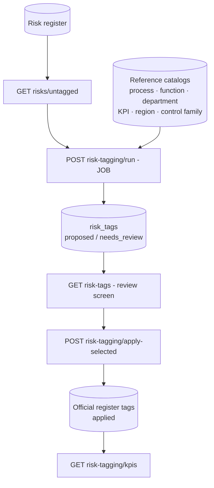

<Note>
**In plain English:** a risk that says "regulatory reporting may be late" is only
useful if the organisation knows *which process* it threatens, *which function*
should care, and *which KPI* it will hurt. This stage proposes those connections
automatically, shows its working, and lets an analyst approve them before
anything becomes official.
</Note>

<CardGroup cols={2}>
  <Card title="Why this stage matters" icon="diagram-project">
    An untagged risk register is a list. A tagged one is an operating tool — it can
    be filtered by process, rolled up by function, and tied to the KPIs it threatens.
  </Card>
  <Card title="What you walk away with" icon="folder-check">
    A business-connected risk register with traceable, analyst-approved tags and a
    completeness KPI you can put on a dashboard.
  </Card>
</CardGroup>

## What happens

The tagging job reads each eligible risk (title, description, the linked issue,
and the control text behind it), compares it against the organisation's
**reference catalogs**, and writes a recommendation per risk with per-tag
confidence, a plain-English rationale, and the evidence fields used. A human
reviewer then applies the tags they accept.

## The six tag dimensions

| Dimension | Question it answers | Catalog source |
| --- | --- | --- |
| `process` | Which business process does this risk threaten? | Business Demography processes (or defaults) |
| `function` | Which function should monitor it? | Business Demography functions (or defaults) |
| `department` | Which department is organisationally responsible? | Derived 1:1 from functions |
| `kpi` | Which measurable outcome does it endanger? | Curated KPI library + one cycle-time KPI per process |
| `region` | Where does it apply? | Business Demography locations + regulatory region |
| `control_family` | Which control theme mitigates it? | ISO/IEC 27001:2022 Annex A themes + AI governance |

<Info>
Catalogs are **bootstrapped automatically** from the organisation's Business
Demography (Stage 02/03 data) the first time tagging runs, so the stage works
out of the box and improves as demography improves. Each catalog item carries a
stable UUID, keywords, criticality, and a catalog version for audit.
</Info>

## How the matching works

<Steps>
  <Step title="Evidence assembly">
    For each risk the engine builds a text bundle from `risk_title`,
    `risk_description`, the **linked issue** text, the **control text** behind that
    issue, and the Stage-08 mapped functions/processes. Every field used is recorded
    in the recommendation's `evidence` array.
  </Step>
  <Step title="Deterministic catalog matching">
    Each catalog item is scored by lexical overlap against the bundle: 55% weight on
    catalog-name token coverage, 45% on curated keyword hits, plus a strong boost
    when a Stage-08 mapping names the item exactly. Scores are calibrated to a 0–1
    confidence.
  </Step>
  <Step title="LLM refinement (optional, fail-safe)">
    When Azure OpenAI is configured, the shortlists are passed to the model to
    pick and re-rank tags with its own rationale. If the model is unavailable or
    returns invalid IDs, the engine **falls back to the deterministic result** —
    the job never fails because the LLM is down.
  </Step>
  <Step title="Routing by confidence">
    Aggregate confidence below `review_required_below_confidence` (default 0.75)
    routes the recommendation to `needs_review`. Auto-apply is **off by default**
    and only ever applies recommendations at or above `confidence_threshold`.
  </Step>
</Steps>

### Inherited tags

- **Department** is inherited from the matched function (slightly lower confidence),
  because departments mirror functions in the bootstrapped catalog.
- **Region** falls back to the organisation's primary operating region from
  demography when the risk text has no regional signal — flagged as such in the
  rationale.

## Domain logic & sources

The tagging model is deliberately aligned to published risk-management practice
rather than invented heuristics:

| Design decision | Source |
| --- | --- |
| Risks must be tagged to processes, objectives (KPIs) and accountable functions before they are actionable | [ISO 31000:2018 — Risk management guidelines](https://www.iso.org/iso-31000-risk-management.html); [COSO ERM 2017 — integrating risk with strategy & performance](https://www.coso.org/guidance-erm) |
| Control-family taxonomy: Organizational / People / Physical / Technological | [ISO/IEC 27001:2022 Annex A control themes](https://www.iso.org/standard/27001) |
| Dedicated **AI & Model Governance** control family (bias & discrimination, privacy, misinformation, malicious use, human-computer interaction, AI system safety) | [MIT AI Risk Repository — risk taxonomy navigator](https://airisk.mit.edu/navigator#/risks/browse) |
| Every recommendation must carry confidence + rationale + evidence; humans approve before metadata becomes official | [NIST AI RMF 1.0 — govern/map/measure/manage with human oversight](https://www.nist.gov/itl/ai-risk-management-framework) |
| Recommendation ≠ application: reviewer identity and timestamp are stored on apply | ISO Robot auditability requirements (API contract §9) |

<Warning>
Rejected or superseded recommendations are never deleted from history once
reviewed — `risk_tags` keeps status, reviewer, notes, inputs, catalog version,
and the job that produced them, so every tag on the register is explainable.
</Warning>

## Endpoints used

| Method | Path | Auth | Purpose |
| --- | --- | --- | --- |
| `GET` | `/risks/untagged` | Bearer | Work queue: untagged / partially tagged risks |
| `POST` | `/risk-tagging/run` | Bearer | Start the `risk_tagging` job (returns `job_id`) |
| `GET` | `/risk-tags` | Bearer | Read recommendations with confidence + rationale |
| `POST` | `/risk-tagging/apply-selected` | Bearer | Apply analyst-approved tags to the register |
| `GET` | `/risk-tagging/kpis` | Bearer | Tagging completeness KPIs |

Full request/response detail: [API Reference → Risk Tagging](/api-reference/risk-tagging).

<Check>
After this stage every risk can answer: *which process, which function, which
department, which KPI, which region, which control family* — each answer traceable
to a catalog version, a confidence score, and a reviewer.
</Check>
