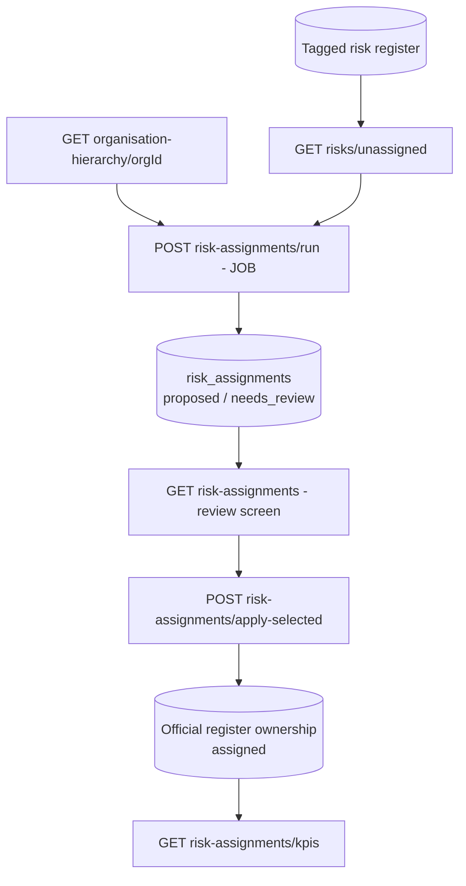
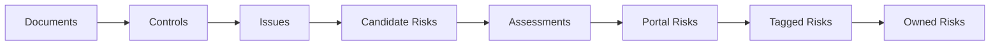

<Note>
**In plain English:** a risk without an owner is nobody's problem. This stage
looks at what each risk is tagged to, walks the organisation hierarchy, and
proposes the person best placed to own it — explaining *why* — so an analyst can
make ownership official with one approval.
</Note>

<CardGroup cols={2}>
  <Card title="Why this stage matters" icon="user-shield">
    ISO 31000 defines a risk owner as the *"person or entity with the
    accountability and authority to manage a risk."* Until that person is recorded,
    the register is informational, not accountable.
  </Card>
  <Card title="What you walk away with" icon="folder-check">
    An accountable risk register: primary owner, optional accountable manager,
    alternates, confidence, rationale — and KPIs for the gaps that remain.
  </Card>
</CardGroup>

## What happens

The assignment job loads unassigned risks, takes their Stage-09 tag context, and
scores every active user in the **approved hierarchy snapshot** with a
transparent weighted model. The best candidate is proposed (with up to two
alternates), low-confidence matches are held for review, and a fallback
ownership rule catches risks nobody matches.

## The matching model

Owner scoring is **deterministic and explainable by design** — every weight is
visible, and the `matched_on` array in each recommendation lists exactly which
signals fired.

| Signal | Weight | Meaning |
| --- | --- | --- |
| `kpi_owner` | **0.35** | The user owns a KPI the risk is tagged to — the strongest accountability signal, because they already answer for the threatened outcome |
| `process_tag` | **0.30** | The user is the named owner of a tagged process |
| `function_tag` | **0.20** | The user leads the function the risk is tagged to |
| `department` | **0.10** | Departmental alignment |
| `region` | **0.10** | The user covers the relevant operating region |
| `management_level` | **±0.05** | High/Extreme-rated risks prefer senior owners (L1–L3); very junior levels are penalised |

Scores are calibrated to a 0–1 confidence. Then:

- confidence ≥ `review_required_below_confidence` (default 0.8) → `proposed`
- below the threshold → `needs_review` (never auto-assigned)
- no signal at all → the `fallback_owner_role` (default `risk_admin`) is proposed
  at low confidence and **always** routed to review
- `best_owner_with_alternates` strategy returns up to two runners-up with their
  own confidence so the analyst can disagree productively

<Info>
**Hierarchy snapshots.** Matching always runs against an *approved snapshot*, not
live user rows, so an assignment made today is explainable against the hierarchy
as it was today. If no snapshot exists, one is bootstrapped automatically from
registered users plus the function/process owners discovered in the catalogs
(`source: auto_bootstrap`), and is returned by `GET /organisation-hierarchy/{orgId}`.
</Info>

## Domain logic & sources

| Design decision | Source |
| --- | --- |
| A risk owner is the person with the *accountability and authority* to manage the risk — so ownership prefers KPI/process accountability over job-title text matching | [ISO 31000:2018 — Risk management guidelines](https://www.iso.org/iso-31000-risk-management.html) |
| Ownership sits in management (first line), with risk oversight separate — the fallback role is an oversight role and is always review-gated | [IIA Three Lines Model (2020)](https://www.theiia.org/en/content/position-papers/2020/the-iias-three-lines-model-an-update-of-the-three-lines-of-defense/) |
| `assignment_type` vocabulary: `primary_owner` / `accountable_owner` / `delegate` / `alternate_owner` | RACI responsibility-assignment convention; COSO ERM 2017 accountability principles |
| Senior owners for high-rated risks; risk-severity-proportionate oversight | [NIST SP 800-30r1 — risk assessments](https://csrc.nist.gov/pubs/sp/800/30/r1/final); COSO ERM 2017 |
| AI-related risks tagged to the AI governance control family route to function leads with explicit oversight roles | [MIT AI Risk Repository — taxonomy navigator](https://airisk.mit.edu/navigator#/risks/browse); [NIST AI RMF 1.0](https://www.nist.gov/itl/ai-risk-management-framework) |
| Recommendation ≠ assignment: reviewer identity + timestamp stored on apply; inactive users never assignable by default | ISO Robot auditability requirements (API contract §9) |

## Guard rails

- `424 RISK_TAGGING_REQUIRED` — if tagging context is requested but every eligible
  risk is untagged, the job refuses to run on title text alone. Run Stage 09 first.
- `409 JOB_ALREADY_RUNNING` — one assignment job per organisation at a time.
- `409 OWNER_ALREADY_ASSIGNED` — an existing owner is never replaced silently;
  send `replace_existing: true` to replace deliberately.
- Inactive hierarchy users are excluded unless `include_inactive_users: true`.

## Endpoints used

| Method | Path | Auth | Purpose |
| --- | --- | --- | --- |
| `GET` | `/risks/unassigned` | Bearer | Work queue: risks without an owner |
| `GET` | `/organisation-hierarchy/{orgId}` | Bearer | The hierarchy snapshot used for matching |
| `POST` | `/risk-assignments/run` | Bearer | Start the `risk_owner_assignment` job |
| `GET` | `/risk-assignments` | Bearer | Read owner recommendations + alternates |
| `POST` | `/risk-assignments/apply-selected` | Bearer | Record analyst-approved ownership |
| `GET` | `/risk-assignments/kpis` | Bearer | Ownership coverage + high-priority gaps |

Full request/response detail:
[API Reference → Risk Owner Assignment](/api-reference/risk-owner-assignment).

## The journey, extended

<Check>
The register is now **assigned and accountable**: every risk has a process, a KPI,
an owner, and an audit trail explaining who recommended what, why, with what
evidence, and who approved it.
</Check>
