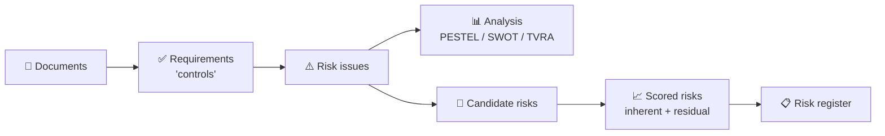

<Note>
**In one sentence:** ISO Robot reads an organisation's policies and regulations and
hands back a prioritised list of risks — each one rated, explained, and traceable
to the exact page it came from.
</Note>

Risk teams spend weeks reading documents, copying requirements into spreadsheets,
arguing about ratings, and rebuilding the same register every audit cycle. ISO
Robot compresses that work into a guided, repeatable pipeline — and keeps a
complete **paper trail** so every result can be defended.

## The problem we solve

<Columns cols={2}>
  <Card title="The old way" icon="file-circle-xmark" horizontal>
    Manual reading, copy-paste into spreadsheets, inconsistent ratings between
    analysts, and no audit trail when the board asks "where did this number come
    from?"
  </Card>
  <Card title="With ISO Robot" icon="wand-magic-sparkles" horizontal>
    Upload the documents, run the pipeline, review the results. Ratings are
    computed by a fixed, published method, and every risk links back to its source.
  </Card>
</Columns>

## What you get

<CardGroup cols={2}>
  <Card title="Documents in" icon="file-arrow-up">
    Upload the policies, standards, and regulations the organisation already
    follows.
  </Card>
  <Card title="Requirements out" icon="list-check">
    Every auditable obligation is extracted automatically — with its source page.
  </Card>
  <Card title="Risks analysed" icon="diagram-project">
    Requirements become risk themes, then get classified (PESTEL / SWOT / TVRA).
  </Card>
  <Card title="A scored register" icon="gauge-high">
    Risks are rated for likelihood, impact, and control strength — ready for the board.
  </Card>
</CardGroup>

## The value chain at a glance

<Info>
**Traceability is the product.** ISO Robot never asks you to trust a number on
faith. Risk ratings are produced by a fixed, published scoring method — the AI only
supplies the expert judgments that feed it. Read more in
[Why ISO Robot](/process/why-iso-robot).
</Info>

## Business outcomes

<CardGroup cols={3}>
  <Card title="Faster cycles" icon="clock">
    Weeks of manual document review collapse into a guided run.
  </Card>
  <Card title="Consistent ratings" icon="scale-balanced">
    The same judgments always produce the same score — no analyst-to-analyst drift.
  </Card>
  <Card title="Audit-ready" icon="shield-check">
    Every risk traces to an issue, to a requirement, to a page.
  </Card>
</CardGroup>

## Who this document is for

This document is written for **two audiences at once**. Throughout, look for
toggles that let you switch between the plain-English view and the technical detail.

<Tabs>
  <Tab title="Business & compliance">
    Start with [Why ISO Robot](/process/why-iso-robot) for the value story, then read
    the [End-to-End Flow](/process/end-to-end-flow) and the per-stage pages. They
    explain **what** happens, **why** it matters, and **what you receive** at each
    step — no code required.

    New to the terminology? Keep the [Glossary](/process/glossary) open in a tab.
  </Tab>
  <Tab title="Engineering & integration">
    Jump to [API Conventions](/api-reference/conventions) and the endpoint pages.
    Every call up to the **Risks Portal** is documented: method, path, auth,
    request body, and response shape. Each pipeline stage page also lists the exact
    endpoints it uses.
  </Tab>
</Tabs>

## The journey in eight stages

The platform runs as **eight ordered stages**. The numbering matches the API
verification suite, so this document, the running system, and the test collection
all line up.

<Steps>
  <Step title="Sign in" icon="key">
    Authenticate to get a secure token and pin the active organisation.
    → [Authentication](/flow/01-authentication)
  </Step>
  <Step title="Onboard documents" icon="folder-open">
    Add the organisation profile and upload its control documents.
    → [Organisation & Documents](/flow/02-org-documents)
  </Step>
  <Step title="Extract requirements" icon="clipboard-check">
    Turn PDFs into structured, page-referenced requirements.
    → [Extract Controls](/flow/03-extract-controls)
  </Step>
  <Step title="Find & frame risks" icon="triangle-exclamation">
    Synthesise risk issues from the requirements and classify them.
    → [Issues](/flow/04-issues) · [Classifications](/flow/05-classifications)
  </Step>
  <Step title="Discover & score" icon="gauge">
    Match issues to the risk library, then rate inherent and residual risk.
    → [Risk Discovery](/flow/06-risk-discovery) · [Risk Scoring](/flow/07-risk-scoring)
  </Step>
  <Step title="Publish the register" icon="list-check">
    Persist the analyst-approved risks to the organisation's register.
    → [Risks Portal](/flow/08-risks-portal)
  </Step>
</Steps>

<Tip>
Short on time? The single best page to understand the whole system is the
[End-to-End Flow](/process/end-to-end-flow) — one diagram, one checklist.
</Tip>

<Note>
This document covers the pipeline **through Stage 08 — Risks Portal**. Read-only
"fetch latest" helpers and legacy/admin utilities are intentionally out of scope.
</Note>
