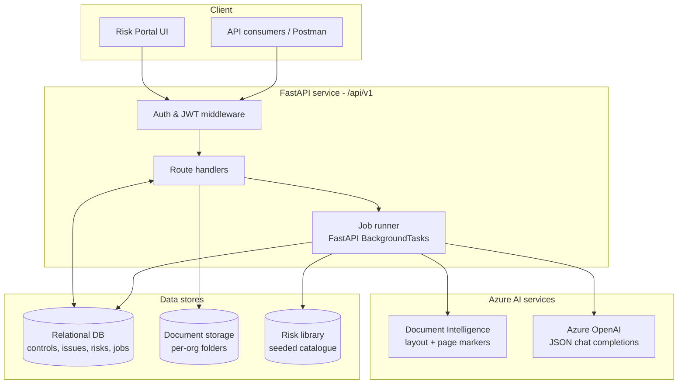

<Note>
**In plain English:** ISO Robot is one application with three helpers — a brain that
reads documents (AI), a filing cabinet that stores everything (database), and a
back office that does slow work without making you wait (background jobs).
</Note>

ISO Robot is a **FastAPI** service backed by a relational store, fronted by a
React portal, and augmented by two Azure AI services. The defining design choice
is that **all heavy work runs as background jobs** so the API stays responsive
while documents are parsed and risks are scored.

## Component map



## The layers

<AccordionGroup>
  <Accordion title="API surface (FastAPI, /api/v1)" icon="server">
    A single versioned API. Public routes (`/health`, `/auth/login`,
    `/auth/register`) need no token; everything else requires a
    `Authorization: Bearer <token>` header. Handlers are thin — they validate
    input, enforce org ownership, read/write the database, and **enqueue jobs**.
  </Accordion>
  <Accordion title="Background job runner" icon="gears">
    Long-running work (extraction, issue synthesis, classification, discovery,
    scoring) is dispatched to `FastAPI BackgroundTasks`. The caller gets an
    immediate `job_id`; the worker advances the job through
    `pending → running → completed | failed`. See
    [Background Jobs](/process/background-jobs).
  </Accordion>
  <Accordion title="Azure Document Intelligence" icon="file-magnifying-glass">
    Converts PDFs into layout-aware text with `[PAGE N]` markers so every
    extracted control can keep a **source page**. If the service rejects an
    oversized PDF, the pipeline falls back to page-batch processing or to local
    PDF text extraction.
  </Accordion>
  <Accordion title="Azure OpenAI (JSON chat)" icon="robot">
    Performs the *judgment* work: extracting controls from text, synthesising
    issues, classifying issues into PESTEL/SWOT/TVRA, proposing candidate risks,
    and rating likelihood / consequence / control effectiveness. All calls return
    strict JSON objects. Where the model is unavailable, deterministic heuristics
    provide a fallback.
  </Accordion>
  <Accordion title="Data stores" icon="database">
    A relational database holds the full chain — documents, controls, issues,
    classifications, candidate risks, risk assessments, portal risks, and the job
    log. Uploaded files live in per-organisation folders. A seeded **risk library**
    provides the reference catalogue that discovery matches against.
  </Accordion>
</AccordionGroup>

## Multi-tenancy & ownership

Every meaningful record is scoped to a **client organisation** (`client_org_id`).
Login returns the caller's active org; handlers reject cross-org access with
`403 FORBIDDEN`. This keeps one client's controls, issues, and risks fully
isolated from another's.

## Determinism where it matters

The platform deliberately splits **judgment** from **calculation**:

| Concern | Owner | Why |
| --- | --- | --- |
| Qualitative judgments (likelihood, consequence, control effectiveness) | Azure OpenAI | Requires reading and reasoning over text |
| Inherent risk, residual risk, recommended response | Fixed scoring matrices | Must be **repeatable, tunable, and auditable** |

Because the rating maths is a published matrix rather than a model output, the
same judgments always produce the same risk rating — and the policy can be tuned
to an organisation's risk appetite without re-prompting the model. See
[Risk Scoring](/flow/07-risk-scoring).

## Base URL

Deployed API (VM):

```text
http://157.20.190.175:8000/api/v1
```

The root health check lives one level up at `http://157.20.190.175:8000/health`.
Full conventions are documented in [API Conventions](/api-reference/conventions).
