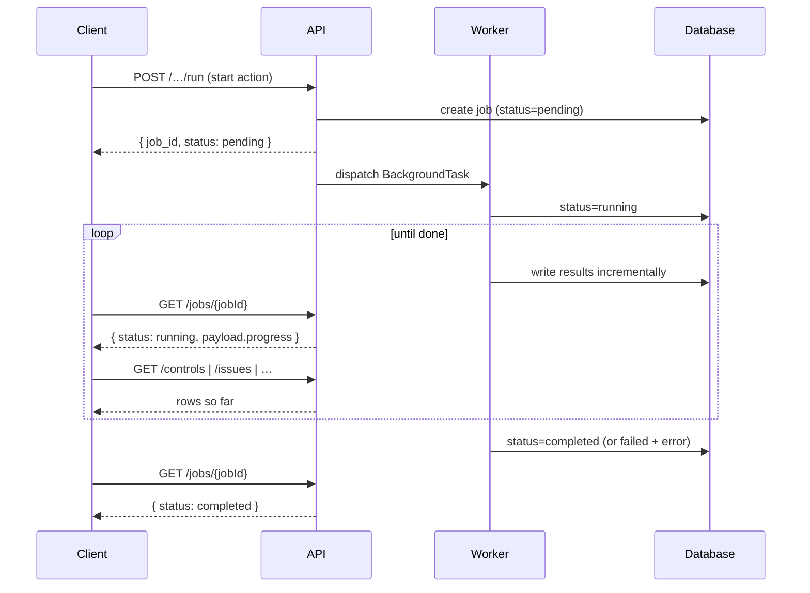
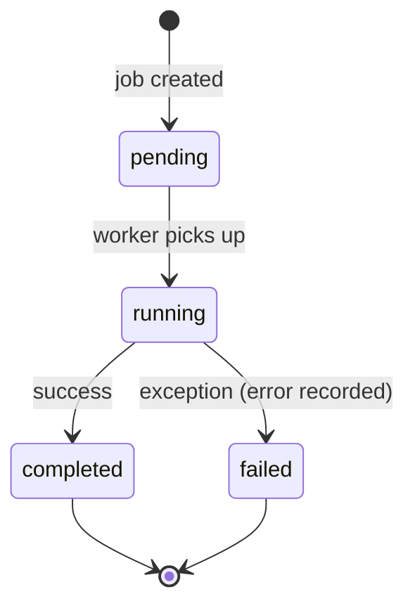
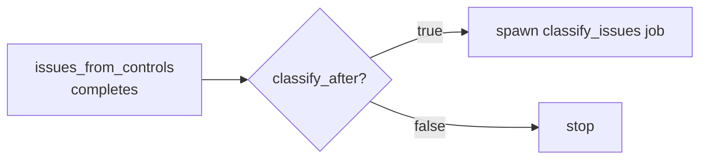

<Note>
**In plain English:** some steps take a while (reading a 200-page PDF, scoring
dozens of risks). Instead of freezing while it works, ISO Robot hands you a
ticket and does the job in the background. You check the ticket until it says
"done," and results appear as they're ready.
</Note>

The expensive parts of the pipeline — parsing PDFs, calling the LLM, scoring risks —
can take seconds to minutes. Rather than block the caller, ISO Robot runs them as
**background jobs**. Every long-running endpoint follows the same three-beat
pattern, so once you learn it once you know it everywhere.

## The pattern

<Steps>
  <Step title="Start">
    `POST` the action endpoint. It returns **immediately** with a job in
    `pending` status and a `job_id`.
  </Step>
  <Step title="Poll">
    `GET /jobs/{jobId}` repeatedly until `status` is `completed` or `failed`.
  </Step>
  <Step title="Fetch data">
    Read the result via the relevant list/detail endpoint. Rows often appear
    **while the job is still running**, because workers commit incrementally.
  </Step>
</Steps>



## Job lifecycle



A polled job returns:

```json
{
  "id": "uuid",
  "type": "extract_controls",
  "status": "pending | running | completed | failed",
  "payload": { "progress": { } },
  "error": null,
  "created_at": "…",
  "updated_at": "…"
}
```

<Info>
The `payload.progress` block is updated as work proceeds — for extraction it
reports the current document, segment, and running control count, so a UI can show
a live progress bar.
</Info>

## Job types

| Job type | Started by | What it produces |
| --- | --- | --- |
| `extract_controls` | `POST /control-documents/extract/{orgId}` | `controls` rows from org PDFs |
| `issues_from_controls` | `POST /issues/from-controls/{orgId}` | `issues` synthesised from controls |
| `classify_issues` | `POST /issues/classify` (or auto after issues) | PESTEL / SWOT / TVRA classifications |
| `risk_discovery` | `POST /risk-discovery/run` | `candidate_risks` matched to the library |
| `score_risks` | `POST /risk-scoring/run` | `risk_assessments` (inherent + residual) |

## Chained jobs

Some actions fan out. When issues are generated with `classify_after: true`, the
`issues_from_controls` job marks itself **completed as soon as the issues exist**,
then spawns a **separate** `classify_issues` job so classification can be tracked
independently and never blocks issue creation.



## Resilience

- A single failing item never kills a batch — scoring and extraction log the
  failure and continue with the rest.
- When the LLM or Document Intelligence is unavailable, the pipeline falls back to
  deterministic heuristics where a fallback exists, so the chain still produces
  output.
- Failures are captured in the job's `error` field for inspection.

<Tip>
**Poll job vs. fetch data are different questions.** Polling `/jobs/{id}` tells you
the *worker's* status. Hitting a list endpoint (`/controls`, `/issues`, …) tells
you what's *in the database right now*. During a run, use both.
</Tip>
