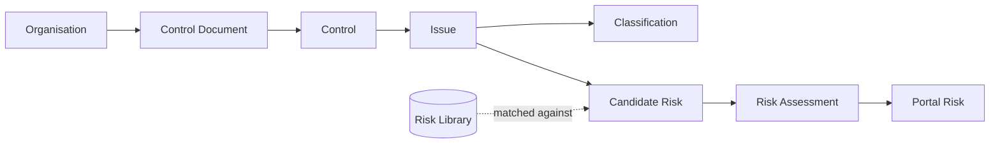

The pipeline is a chain of objects, each derived from the previous one. Understanding
these seven concepts is enough to understand the whole platform.

<Tip>
Prefer everyday words? Here is the same chain in plain language:

| Technical term | In plain English |
| --- | --- |
| Control | A rule the organisation must follow |
| Issue | A risk theme those rules point to |
| Classification | Different angles on that risk (political, legal, …) |
| Candidate risk | A proposed risk matched to a known catalogue |
| Risk assessment | The risk, scored for likelihood and impact |
| Portal risk | A risk the analyst approved for the register |
</Tip>

## The object chain

<Tip>
Read the chain as a sentence: *an organisation's documents yield controls; controls
yield issues; issues are classified, matched into candidate risks against the risk
library, then scored into assessments, and finally published as portal risks.*
</Tip>

## The objects

<AccordionGroup>
  <Accordion title="Organisation" icon="building">
    The tenant. Identified by `client_org_id`. Carries a business demography
    profile (industry, region) that contextualises later analysis. Everything else
    in the chain belongs to exactly one organisation.
  </Accordion>
  <Accordion title="Control Document" icon="file-pdf">
    A source file (PDF/DOCX/XLSX/TXT) uploaded for an organisation — a policy,
    standard, or regulation. Tracked with metadata: filename, type, category, and
    processing status.
  </Accordion>
  <Accordion title="Control" icon="clipboard-check">
    One distinct, auditable requirement extracted from a document — a single
    obligation, mandatory procedure, or measurable rule. Each control keeps its
    `control_text`, optional `section_ref` / `framework`, and a `source_page` so it
    is traceable to the originating document.
  </Accordion>
  <Accordion title="Issue" icon="triangle-exclamation">
    A risk theme synthesised from a cluster of related controls. An issue has a
    `title`, a `body` (2–5 sentences), a `scope` (`internal` or `external`), a
    `sector`, an optional `region_hint`, and the `control_ids` it was derived from.
    Issues are the central unit the rest of the pipeline reasons about.
  </Accordion>
  <Accordion title="Classification" icon="chart-pie">
    Analytical lenses applied to an issue:
    - **PESTEL** — Political, Economic, Social, Technological, Environmental, Legal.
    - **SWOT** — strengths, weaknesses, opportunities, threats.
    - **TVRA** — threats, vulnerabilities, actors (threat & vulnerability risk assessment).
    - **Geo / Global** — geopolitical tags and cross-cutting labels.

    Classifications power the charts in the portal.
  </Accordion>
  <Accordion title="Risk Library & Candidate Risk" icon="book">
    The **risk library** is a seeded catalogue of known enterprise risks. During
    discovery, each issue is matched against the library using BM25 keyword
    ranking plus an LLM pass, producing **candidate risks** — proposed risks with a
    `match_status`, a `library_risk_id` when matched, a `bm25_score`, and the
    `issue_ids` they came from.
  </Accordion>
  <Accordion title="Risk Assessment" icon="gauge">
    The scored result for an issue. The LLM supplies qualitative judgments
    (`likelihood`, `consequence`, `velocity`, `risk_type`, and per-control
    `effectiveness`); fixed matrices then derive `inherent_risk`, `residual_risk`,
    and the recommended `risk_response`. See [Risk Scoring](/flow/07-risk-scoring).
  </Accordion>
  <Accordion title="Portal Risk" icon="list-check">
    The risks an analyst selects and publishes to the organisation's register via
    the [Risks Portal](/flow/08-risks-portal). This is the final, curated output.
  </Accordion>
</AccordionGroup>

## Controlled vocabularies

Risk scoring uses fixed vocabularies so results are comparable across issues and
organisations:

| Dimension | Allowed values |
| --- | --- |
| Likelihood | Rare · Unlikely · Possible · Likely · Almost Certain |
| Consequence | Insignificant · Minor · Moderate · Major · Severe |
| Velocity | Very Slow · Slow · Moderate · Fast · Immediate |
| Control effectiveness | Effective · Partially Effective · Ineffective · Uncontrolled |
| Risk level | Low · Medium · High · Extreme |
| Risk response | Accept · Mitigate · Transfer · Avoid |

<Note>
Any value the model returns outside these vocabularies is **rejected** during
validation, so a malformed judgment can never silently corrupt a score.
</Note>
