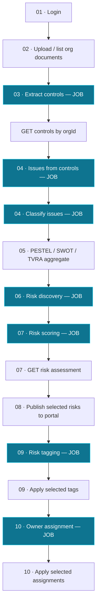

This page is the map. It shows the full pipeline — all eight stages — in one
diagram, then summarises what goes in and what comes out at each stage. Use it as
the index to the per-stage pages.

<Note>
**Read this first.** If you only read one page, read this one. It connects every
stage so the detailed pages make sense in context.
</Note>

## The complete pipeline

<Note>
Boxes in teal are **background jobs** — start, poll, then read the result. See
[Background Jobs](/process/background-jobs).
</Note>

## Stage-by-stage summary

<table>
  <thead>
    <tr><th>Stage</th><th>You provide</th><th>You get back</th><th>Mechanism</th></tr>
  </thead>
  <tbody>
    <tr>
      <td>[01 Authentication](/flow/01-authentication)</td>
      <td>Username & password</td>
      <td>Bearer token + active org id</td>
      <td>Sync</td>
    </tr>
    <tr>
      <td>[02 Org & Documents](/flow/02-org-documents)</td>
      <td>Org profile + control documents</td>
      <td>Stored documents & demography</td>
      <td>Sync</td>
    </tr>
    <tr>
      <td>[03 Extract Controls](/flow/03-extract-controls)</td>
      <td>Trigger on the org's PDFs</td>
      <td>Page-referenced controls</td>
      <td>Job</td>
    </tr>
    <tr>
      <td>[04 Issues](/flow/04-issues)</td>
      <td>Trigger on the org's controls</td>
      <td>Risk issues (+ optional classification)</td>
      <td>Job (+ chained job)</td>
    </tr>
    <tr>
      <td>[05 Classifications](/flow/05-classifications)</td>
      <td>An org with classified issues</td>
      <td>PESTEL / SWOT / TVRA chart data</td>
      <td>Sync read</td>
    </tr>
    <tr>
      <td>[06 Risk Discovery](/flow/06-risk-discovery)</td>
      <td>Seeded library + issues</td>
      <td>Candidate risks matched to library</td>
      <td>Job</td>
    </tr>
    <tr>
      <td>[07 Risk Scoring](/flow/07-risk-scoring)</td>
      <td>Issue ids</td>
      <td>Inherent & residual risk assessments</td>
      <td>Job</td>
    </tr>
    <tr>
      <td>[08 Risks Portal](/flow/08-risks-portal)</td>
      <td>Analyst-selected risks</td>
      <td>Published risk register</td>
      <td>Sync</td>
    </tr>
    <tr>
      <td>[09 Risk Tagging](/flow/09-risk-tagging)</td>
      <td>Trigger on the org's register</td>
      <td>Reviewed process / function / KPI / region / control-family tags</td>
      <td>Job + sync apply</td>
    </tr>
    <tr>
      <td>[10 Risk Owner Assignment](/flow/10-risk-owner-assignment)</td>
      <td>Hierarchy snapshot + tagged risks</td>
      <td>Accountable owners with alternates & rationale</td>
      <td>Job + sync apply</td>
    </tr>
  </tbody>
</table>

## The "happy path" run order

<Steps>
  <Step title="Log in">
    `POST /auth/login` → save the `access_token` and `client_org_id`.
  </Step>
  <Step title="Confirm documents exist">
    `GET /control-documents/{orgId}` → ensure at least one PDF is uploaded.
  </Step>
  <Step title="Extract controls">
    `POST /control-documents/extract/{orgId}` → poll the job → `GET /controls`.
  </Step>
  <Step title="Generate issues">
    `POST /issues/from-controls/{orgId}` with `classify_after: true` → poll → `GET /issues`.
  </Step>
  <Step title="Review classification charts">
    `GET /classifications/aggregate` once the classify job completes.
  </Step>
  <Step title="Seed library & run discovery">
    `POST /risk-library/seed-from-poc` (once) → `POST /risk-discovery/run` → poll → `GET /candidate-risks`.
  </Step>
  <Step title="Score risks">
    `POST /risk-scoring/run` → poll → `GET /issues/{id}/risk-assessment`.
  </Step>
  <Step title="Publish">
    `POST /risks/upload-selected` → `GET /risks/{orgId}`.
  </Step>
</Steps>

<Tip>
While any job runs, re-hit the matching read endpoint to watch rows accumulate.
The relationship between "poll the job" and "fetch the data" is explained in
[Background Jobs](/process/background-jobs).
</Tip>
